# Natural Language Processing with Classification and Vector Spaces
Welcome to the [first course](https://www.coursera.org/learn/classification-vector-spaces-in-nlp) of the Natural Language Processing Specialization at [Coursera](https://www.coursera.org/specializations/natural-language-processing) which is moderated by [DeepLearning.ai](http://deeplearning.ai/). The course is taught by Younes Bensouda Mourri, Łukasz Kaiser and Eddy Shyu.

## Table of contents

- [Natural Language Processing with Classification and Vector Spaces](#natural-language-processing-with-classification-and-vector-spaces)
  - [Table of contents](#table-of-contents)
  - [Course summary](#course-summary)
  - [Logistic regression](#logistic-regression)
    - [Supervised Machine Learning & Sentiment Analysis](#supervised-machine-learning--sentiment-analysis)
    - [Feature Extraction](#feature-extraction)
    - [Preprocessing](#preprocessing)
    - [Training Logistic Regression](#training-logistic-regression)
    - [Testing Logistic Regression](#testing-logistic-regression)
    - [Cost Function](#cost-function)
  - [Naive Bayes](#naive-bayes)

## Course summary
This is the  course summary as its given on the course [link] (https://www.coursera.org/learn/classification-vector-spaces-in-nlp):

> In Course 1 of the Natural Language Processing Specialization, offered by deeplearning.ai, you will:
> a) Perform sentiment analysis of tweets using logistic regression and then naïve Bayes, 
> b) Use vector space models to discover relationships between words and use PCA to reduce the dimensionality of the vector space and visualize those relationships, and
c) Write a simple English to French translation algorithm using pre-computed word embeddings and locality sensitive hashing to relate words via approximate k-nearest neighbor search.
 
> Please make sure that you’re comfortable programming in Python and have a basic knowledge of machine learning, matrix multiplications, and conditional probability.

> By the end of this Specialization, you will have designed NLP applications that perform question-answering and sentiment analysis, created tools to translate languages and summarize text, and even built a chatbot!

> This Specialization is designed and taught by two experts in NLP, machine learning, and deep learning. Younes Bensouda Mourri is an Instructor of AI at Stanford University who also helped build the Deep Learning Specialization. Łukasz Kaiser is a Staff Research Scientist at Google Brain and the co-author of Tensorflow, the Tensor2Tensor and Trax libraries, and the Transformer paper.

Supervised Machine Learning
> Learn about supervised machine learning and specifically about logistic regression and the steps required in order to implement this algorithm.

## Logistic regression
### Supervised Machine Learning & Sentiment Analysis
- In supervised machine learning you have input features X and a set of labels Y.
- The goal is to minimize your error rates or cost as much as possible.
- To do this, run the prediction function which takes in parameters data to map your features to output labels Ŷ.
- The best mapping from features to labels is achieved when the difference between the expected values Y and the predicted values Ŷ hat is minimized.
- The cost function F does this by comparing how closely the output Ŷ is to the label Y.
- Update the parameters and repeat the whole process until your cost is minimized.
   - 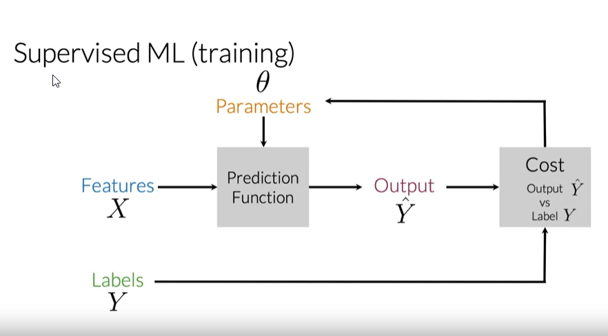
- The function F is equal to the sigmoid function
  - 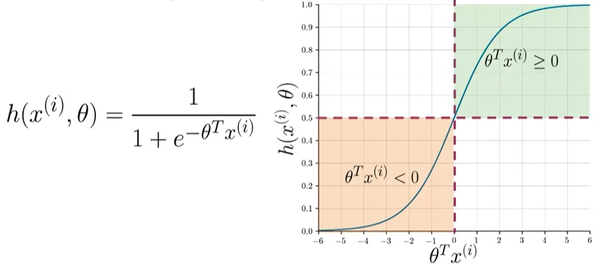

- Example of Supervised machine learning classification task for sentiment analysis:
> The objective is to predict whether a tweet has a positive or a negative sentiment.
   - to build the Logisitic regression classifier, we can do that in 3 steps: extract features, train, predict:
      1. Process the raw tweets in the training sets and extract useful features.
         - Tweets with a positive sentiment have a label of one, and the tweets with a negative sentiment have a label of zero.
      2. Train your logistic regression classifier while minimizing the cost
      3. Make your predictions
   - 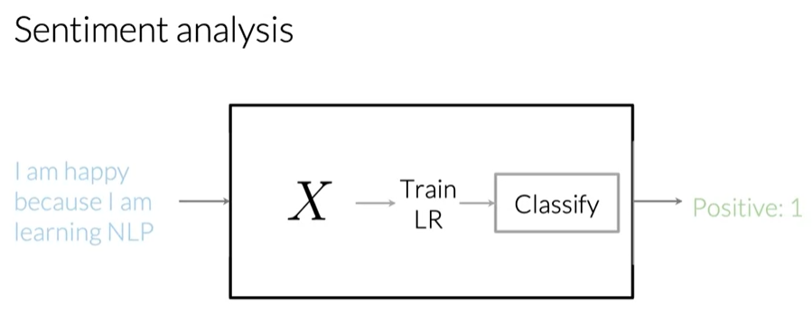

### Feature Extraction
 1. Sparse Represenation
    - To represent a text as a vector, we have to build a vocabulary and that will allow to encode any text or any tweet as an array of numbers
    - The vocabulary *V* would be the list of unique words from your list of tweets.
    - Sparse Represenation assign a value of 1 to that a word of a tweet, If it doesn't appear in the vocabulary V we assign a value of 0.
    - 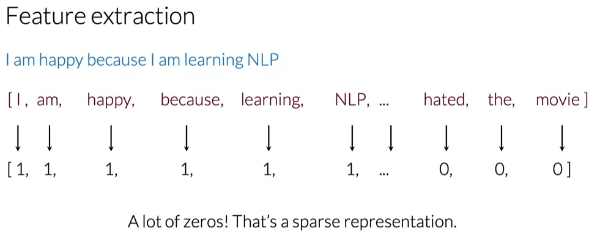
    - problems with sparse represenation:
    - A logistic regression model would have to learn N+1 parameters, where N is the size of the vocabulary *V* 
    - Large training time
    - Large prediction time
        - 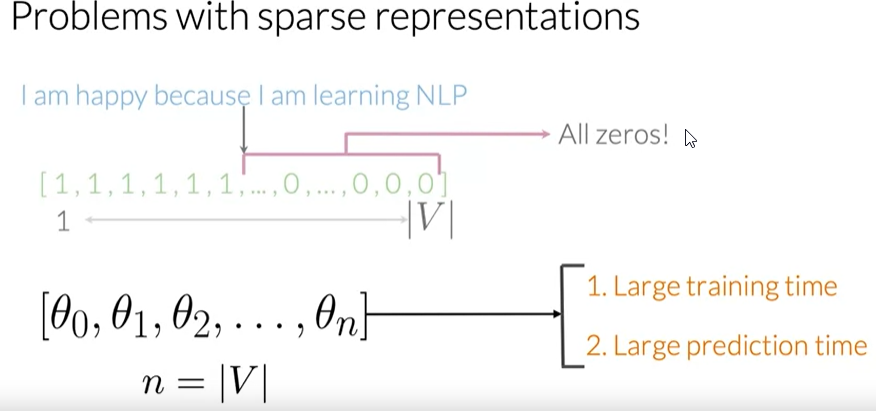
        
 2. Negative and Positive Frequencies
    - Set a unique words from tweets corpus, your vocabulary.
    - Build two classes, One class associated with positive sentiment and the other with negative sentiment.
    - To get the positive frequency in any word in your vocabulary, you count the times as it appears in the positive tweets, and same apply for negative tweets.
       - 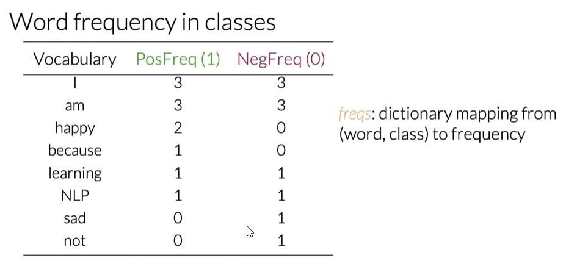
    - In practice when coding, this table is a dictionary maps the word and its corresponding class to the frequency.
    - Use the dictionary to extract useful features for sentiment analysis, to represent a tweet in a vector of dimension 3
       - [bias=1,sum of the positive frequencies for every unique word on tweet, sum of the negative frequencies for every unique word on tweet]
       - 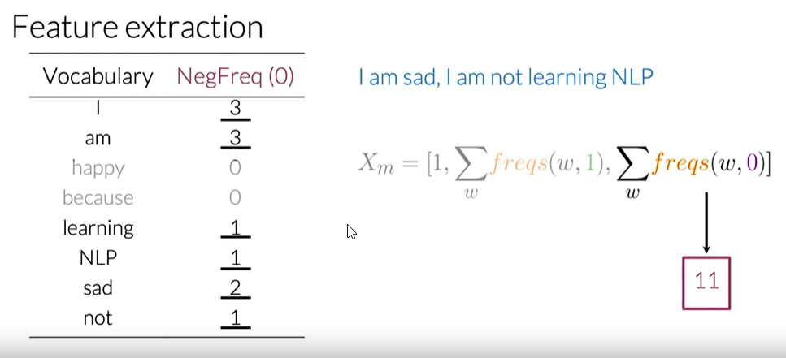

### Preprocessing
- Use of stemming and stop words for text pre-processing
- First, I remove all the words that don't add significant meaning to the tweets, aka. stop words and punctuation marks.
- In some contexts you won't have to eliminate punctuation. So you should think carefully about whether punctuation adds important information to your specific NLP task or not.
- Stemming in NLP is simply transforming any word to its base stem.
  - 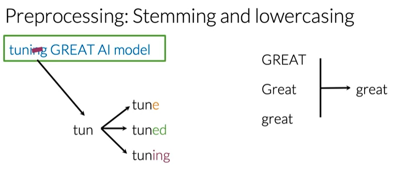
  -  

### Training Logistic Regression
- To train a logistic regression classifier, iterate until you find the set of parameters θ, that minimizes your cost function.
- This algorithm of training is called gradient descent.
  - 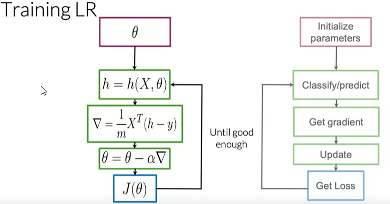
  
### Testing Logistic Regression
- You will need X_val and Y_val, Data that was set-aside during trainings, also known as the validation sets and θ.
1. First, compute the sigmoid function for X_val with parameters θ
2. Second, evaluate if each value of h of Theta is greater than or equal to a threshold value, often set to 0.5
3. compute the accuracy of your model over the validation sets
   - 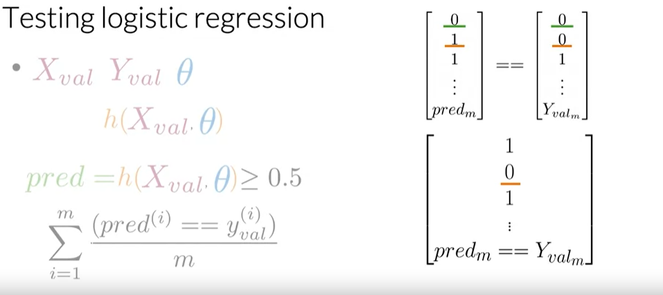

### Cost Function 
- The variable m, which is just the number of training examples in your training set indicates thesum over the cost of each training example.
- The equation has two terms that are added together:
  - the left part y(i)*log h(x(i),θ) is the logistic regression function log(Ŷ) applied to each training example y(i)
  - if y = 1 ==> L(Ŷ,1) = -log(Ŷ) ==> we want Ŷ to be the largest ==> Ŷ biggest value is 1
  - if y = 0 ==> L(Ŷ,0) = -log(1-Ŷ) ==> we want 1-Ŷ to be the largest ==> Ŷ to be smaller as possible because it can only has 1 value.
    - 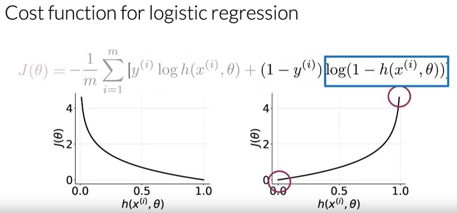

## Naive Bayes
- In a corpus of tweets that can be categorized as either positive or negative sentiment, such words are sometimes being labeled positive and sometimes negative.pain
- 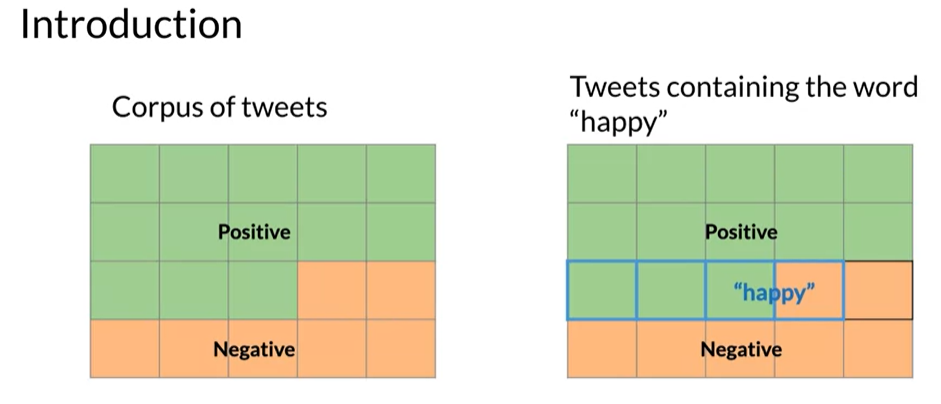
- Defining events A as a tweet being labeled positive, then the probability of events A shown as P of A here is calculated as the ratio between the count of positive tweets and the corpus divided by the total number of tweets in the corpus. 
- Think about probabilities as counting how frequently an events occur.
- The probability of the tweets expressing a negative sentiment is just equal to one minus the probability of a positive sentiment.
- 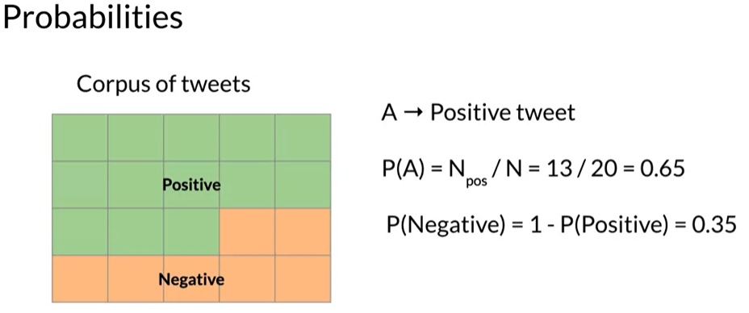
- Conditional probabilities is the probability of an outcome B knowing that event A already happened.
- Bayes' rul   e states that the probability of X given Y is equal to the probability of Y given X times the ratio of the probability of X over the probability of Y.
- 
-  The first step for Naive Bayes allows you to compute the conditional probabilities of each word given the class. 
-  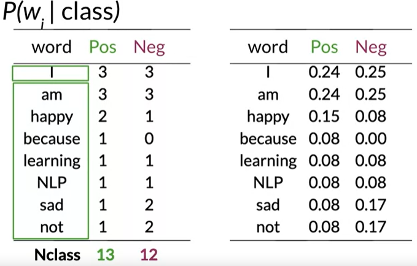
-Laplacian smoothing, a technique you can use to avoid your probabilities being zero.

- 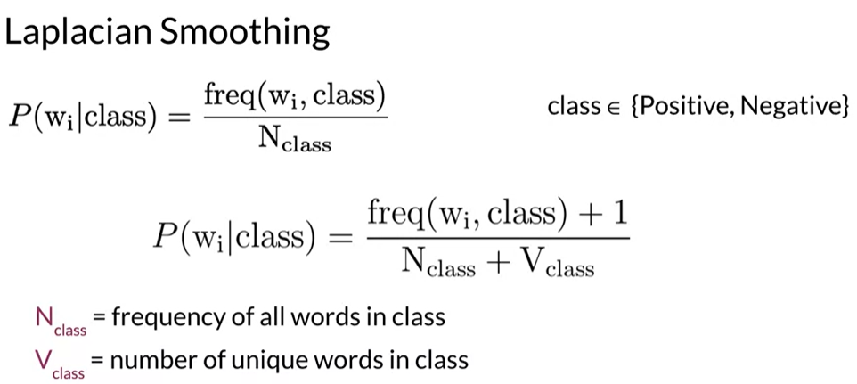
- based on the last table, ratio of probability are defined as the positive conditional probabilitie of a word divided by its negative probability.
- 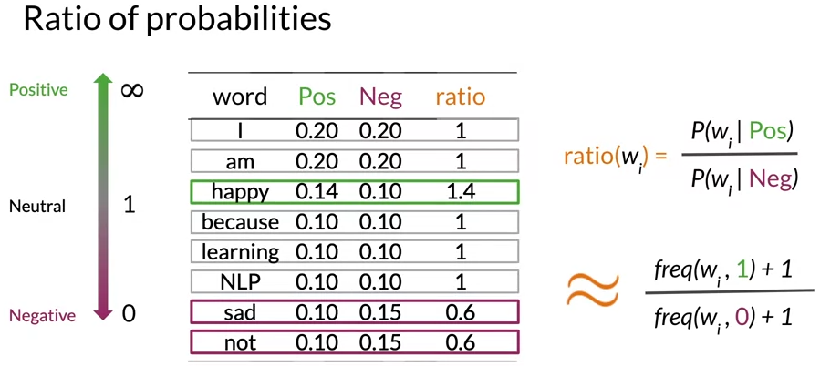
- Likelihood times prior 
- 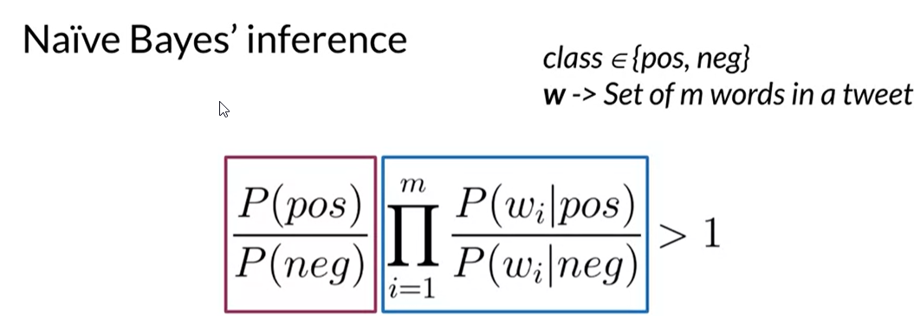
- To avoid numerical underflow (due to multiplying small numbers) we compute the log of the likelihood
- 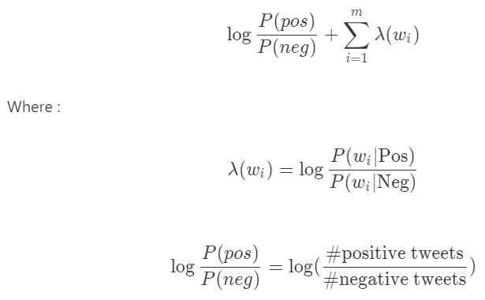
- If the Log Likelihood + log prior > 0 Then the tweet has a positive sentiment. Otherwise, the tweet has a negative sentiment.
- To training Naïve Bayes model you need to do:
    1. Get and annotate the dataset with positive and negative tweets
    2. Preprocess the tweets
       1. Lowecase
       2. Remove punctuation, urls, names
       3. Remove stop words
       4. Stemming: reducig words to their common stem
       5. Tokenize sentences: splitting the document into single words or tokens.
    3. computing the vocabulary for each word and class: freq(w,class)
    4. get probability for a given class by using the Laplacian smoothing formula: P(w|pos),P(w|neg)
    5. Compute λ(w), log of the ratio of your conditional probabilities
    6. Compute logprior=log(P(Pos)/P(Neg))
- To test the trained model, we take the conditional probabilities and we use them to predict the sentiments of new unseen tweets.
- To evaluate the model, we use the test sets of annotated tweets 
- Given a test set X_val, Y_val we compute the score, which is a function of X_val, λ, log prior. The prediction is $pred = score>0
- The accuracy is then
  - 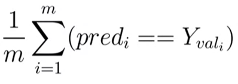
- Words that are not seen in the training set are considered neutral, and so add **0** to the score 
- Naïve Bayes Applications
  - Sentiment analysis
    - 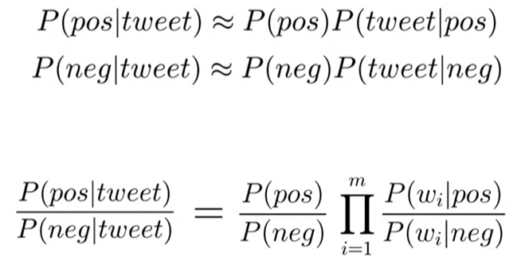
  - Author identification
    - 
  - Spam filtering
    - 
  - Information retrieval
    - 
  - Word disambiguation
    - For example if we can not decide whether the word **bank** (for example) refers to the river or the financial institution, compute the ratio
    - 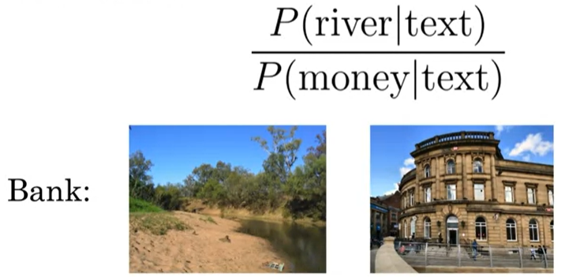
- Naïve Bayes Assumptions:
  - Conditional Independence : Not True in NLP
  - Relative frequency of training classes affect the model and can be not representative of the real world distribution
- Naive bayes Error Analysis
  - Preprocessing
    - Removing punctuation (example ':(' )
    - Removing stop words
  - Word order (not word order in the sentence)
    - Example : I am happy because I did not go Versus I am not happy because I did go
  - Adversarial attacks (Easily detected by humans but algorithms are usually terrible at it)
    - Sarcasm, Irony, Euphemisms, etc
    - Example: This is a ridiculously powerful movie. The plot was gripping and I cried right through until the ending.
    